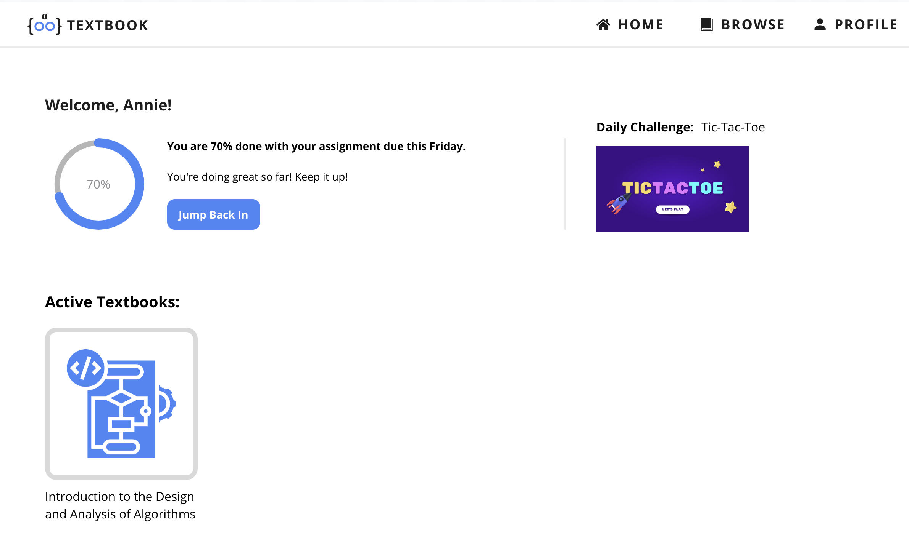
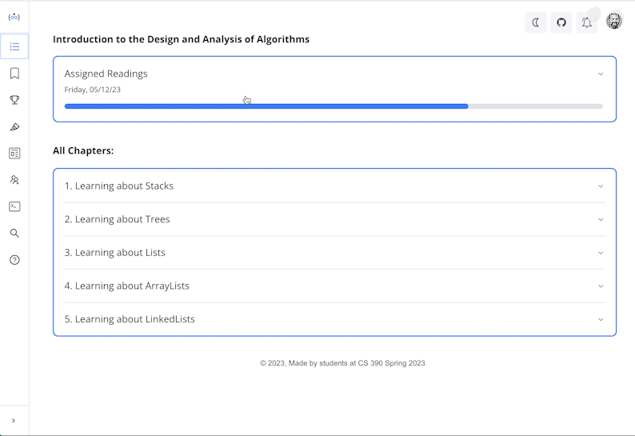
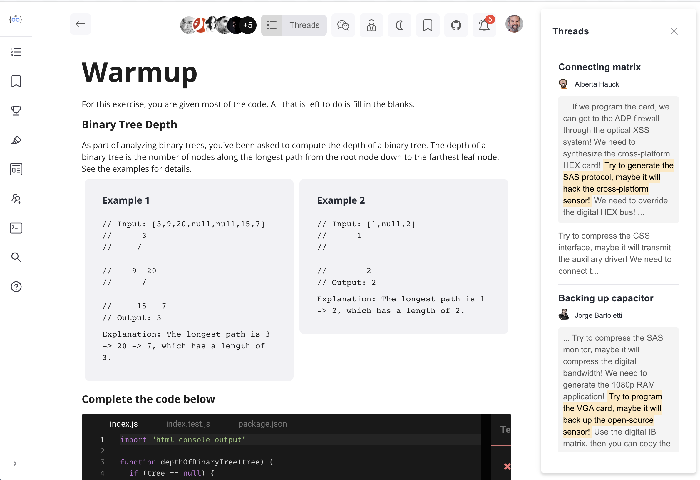

# CompSci 390 APT Update

_A collaborative work by Alice Hu, Annie Sawers, Murilo Calegari, Silas Lenihan, Teya Evans, and Trinity Johnson_ on a new Computer Science Textbook.

### Project goals and distinctive features

For our final project in COMPSCI 390 — Educational Technology,
we are creating a proof-of-concept for a modern and collaborative textbook:

- The textbook is modern in that its lessons are generated using
  MDX files, which are superset of Markdown that allows for the
  usage of JSX React components. This allows for professors to easily
  write content that mix both text and interactive components as they wish.

- We focused on building tools that would enhance the collaborative
  aspect of the textbook. We built a chat & threads system that allows
  for students to collaborate on building knowledge together.
  They can create contextualized threads that are mapped
  to highlighted parts of the textbook, the same thing for chats as they can be specific
  to a chapter lesson.

- We also implemented an AI assistant that can answer questions based on the context
  of the current highlighted text. This is done using a backend service that calls
  the Fixie API to generate answers from our pre-modeled prompts that query a LLM.

- We also wanted to make the textbook use interactive components and animations.
  We leveraged CodeSandBox iframes to allow for students to write code directly
  on the textbook and see the results. We also envisioned a few animations that
  are intended to illustrate some concepts in a more engaging way.

- Some of our code problems are displayed as Parson's problems such that students
  are given lines of code that they can add and sort as part of their final solution.

### Website architecture

The website is built using React with an extensive use of RSuite components.
We also use Mobx for state management and React Router for routing. In the future,
we intended to migrate to Next.js to leverage its server-side rendering capabilities
and/or code splitting.

### How to run the website

```
npm install
npm run dev
```

#### OPTIONAL: To run with the local express server:

Note: This is only necessary to run the express server locally.
It will work using the Render server by default.
You can find the backend for the Fixie API integration [here](https://github.com/silaslenihan/online-textbook-backend)

1. Edit the queryFixie.ts file to query the local server 2. `const url = 'http://localhost:5000/api/agents/silaslenihan/example-agent';`
2. Make an account on [Fixie](app.fixie.ai)
3. Go to your profile, get the API key
4. Make a new file called `.env` based on the `.env.example`
5. Copy in your Fixie API Key.
6. Run the following command:

```
npm run dev:proxy
```

### Attributions

- We started this website based off [RSuite's Admin Dashboard template](https://github.com/rsuite/rsuite-admin-template)
- Some (only partially successful) help from ChatGPT for small bug fixes and for generating some of the mock data or base code.
- GitHub Copilot was active during the development of this project, with occasional boilerplate code being generated by it.
  It was not used for the website's architecture and component design.
- Sound effects for APT submission are from [pixabay.com](https://pixabay.com/sound-effects/)
- Core textbook content is based on Prof. Brandon Fain's COMPSCI 201 slides.

### Work breakdown

- [Alice Hu](https://github.com/aliceyuhehu): Core textbook content and Highlight's page
- [Annie Sawers](https://github.com/anniesawers): UI/UX design, Table of Contents, Home Page, Browse, and some of the general textbook styles
- [Murilo Calegari](https://github.com/MuriloCalegari): Base website architecture, Course APTs and file submission, Chat & Threads sidebar + page, CodeSandBox integration
- [Silas Lenihan](https://github.com/silaslenihan): Fixie API integration hosted on custom external web server. AI Assistant and code helper, bookmark & highlight features.
- [Teya Evans](https://github.com/teyaevans): Journey page and Friends Center
- [Trinity Johnson](https://github.com/nerdyTJ): Parson's problems

### Future work

- Most of the data we use is currently mocked or hardcoded.
  However, we made extensive use of typescript interfaces that are easily
  mapped to JSON files that can be served by a backend.
- Similarly, the MDX files are currently static and hardcoded,
  but we have implemented a MDXOnDemand component that compiles
  and renders MDX files on the fly. This can be used to display content
  based on files that could be retrieved from the backend as professors
  write them
- Right now, all the interactions a user has is saved locally on the browser
  as a React state, there is no implemented idea of persistence or user accounts.
- We have a lot of ideas for animations and interactive components that
  would require some progressive, extensive work to be executed.
  But we strongly believe that our MDX approach should allow for easier
  and reusable implementation of these ideas.
- We only implemented the user side of the website,
  while a final version would also most likely include a professor side,
  allowing for them to write content and manage their courses.
- We would also love to integrate the APT system with Duke's official
  APT submission system.

### Screenshots






